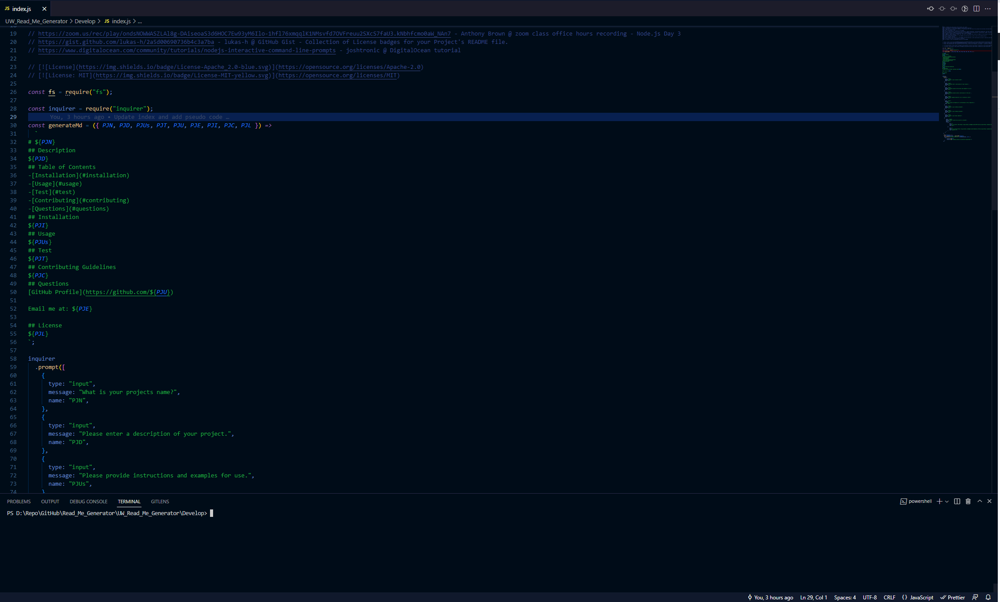

# **<u>Read Me Generator</u>**

This is a read me generator for UW coding boot camp project 9. Acceptance criteria included:

GIVEN a command-line application that accepts user input

WHEN I am prompted for information about my application repository

THEN a high-quality, professional README.md is generated with the title of my project and sections entitled Description, Table of Contents, Installation, Usage, License, Contributing, Tests, and Questions

WHEN I enter my project title

THEN this is displayed as the title of the README

WHEN I enter a description, installation instructions, usage information, contribution guidelines, and test instructions

THEN this information is added to the sections of the README entitled Description, Installation, Usage, Contributing, and Tests

WHEN I choose a license for my application from a list of options

THEN a badge for that license is added near the top of the README and a notice is added to the section of the README entitled License that explains which license the application is covered under

WHEN I enter my GitHub username

THEN this is added to the section of the README entitled Questions, with a link to my GitHub profile

WHEN I enter my email address

THEN this is added to the section of the README entitled Questions, with instructions on how to reach me with additional questions

WHEN I click on the links in the Table of Contents

THEN I am taken to the corresponding section of the README

## <u>Lessons learned</u>

- Using template literals to generate the markdown helps resolve formatting issues
- Inquirer checkbox would probably be better for user input with the possibility of multiple selections from the user (in this project I used expand as the instructions stated to choose a license, not licenses). 

## <u>Built With</u>

- JavaScript
- Inquirer

## <u>Deployed Link</u>

- https://murltrainham.github.io/UW-Password-Generator/

## <u>Authors</u>

- Murl Trainham Jr.

  [Link to Github](https://github.com/murltrainham)
  Email me at: murltrainham@gmail.com
